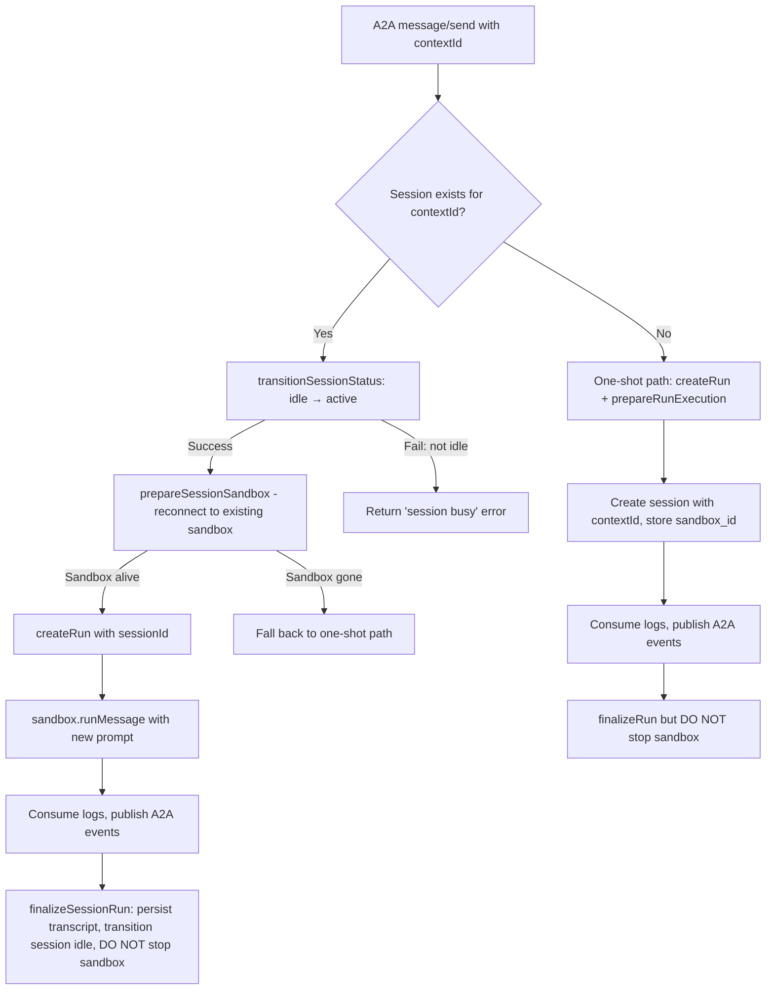

# feat: A2A multi-turn sandbox reuse via contextId

## Overview

When multiple A2A messages share the same `contextId` (e.g., messages in a Discord chat thread), reuse the same Vercel Sandbox so the agent maintains conversation memory, tool state, and file system across turns. Currently every A2A message creates a fresh sandbox — the agent loses all context between messages.

## Problem Frame

AgentPlane treats each A2A message as stateless. The session infrastructure (sessions table, `reconnectSandbox`, `runMessage`, session history) already exists for the Chat/Session flow but is not wired into the A2A path. The first attempt to add this failed because it delegated to `executeSessionMessage()`, which creates its own "Chat" run — producing duplicate runs. (see origin: `docs/brainstorms/2026-03-30-a2a-multi-turn-sandbox-reuse-requirements.md`)

## Requirements Trace

- R1. Reuse existing session sandbox when `contextId` matches an active/idle session
- R2. Create new session on first message with a `contextId`; store contextId for future lookup
- R3. Each A2A message creates its own run linked to the session via `session_id`
- R4. New message delivered as a continuation — agent sees session history from prior turns
- R5. Session idle timeout and cleanup continue to work
- R6. Concurrent messages serialized via idle→active transition lock
- R7. Fall back to fresh sandbox if reconnection fails
- R8. Preserve client-supplied `contextId` in A2A responses

## Scope Boundaries

- **Not changing**: Chat/Session executor flow (web UI sessions)
- **Not changing**: `prepareRunExecution()` — still used for first-time / no-contextId runs
- **Not building**: Cross-agent session sharing
- **A2A only**: No changes to web UI sessions, scheduled runs, or admin-triggered runs

## Context & Research

### Relevant Code and Patterns

- `src/lib/a2a.ts` — `SandboxAgentExecutor.execute()` (line 429): current one-shot flow. Creates run, calls `prepareRunExecution()`, consumes logs, calls `finalizeRun()`. Destroys sandbox on completion.
- `src/lib/sandbox.ts` — `SessionSandboxInstance.runMessage()` (line 1048): file-based protocol. Writes a new runner script (`runner-{runId}.mjs`) to sandbox filesystem, executes as detached process, streams logs. This is the primitive for sending a new message to an existing sandbox.
- `src/lib/sandbox.ts` — `reconnectSessionSandbox()` (line 1166): reconnects to existing Vercel Sandbox by ID. Returns `SessionSandboxInstance` or null if sandbox is gone. Rebuilds MCP config.
- `src/lib/sandbox.ts` — `createSessionSandbox()` (line 812): creates new sandbox for sessions. Returns `SessionSandboxInstance` with `runMessage()` method.
- `src/lib/session-executor.ts` — `prepareSessionSandbox()` (line 74): reconnects or creates session sandbox. `executeSessionMessage()` (line 225): creates run with `triggeredBy: "chat"` then calls `runMessage()`. `finalizeSessionMessage()` (line 309): persists transcript, backs up session file, transitions session to idle.
- `src/lib/sessions.ts` — Session CRUD with atomic state transitions. `transitionSessionStatus()` uses SQL `WHERE status = $from` for atomic locking.
- `src/lib/types.ts` — `SESSION_VALID_TRANSITIONS` (line 86): `creating → active ↔ idle → stopped`.
- `src/lib/run-executor.ts` — `prepareRunExecution()`: creates sandbox, transitions run to running, returns `{ sandbox, logIterator, transcriptChunks }`. `finalizeRun()`: persists transcript, stops sandbox.
- `src/db/migrations/014_sessions_table.sql` — Sessions schema with `sandbox_id`, `sdk_session_id`, `session_blob_url`, `status`, `message_count`, `mcp_refreshed_at`.

### Key Insight from Failed Attempt

`executeSessionMessage()` creates its own run with `triggeredBy: "chat"`, which is why it produced a duplicate run alongside the A2A run. The correct approach: use `prepareSessionSandbox()` and `sandbox.runMessage()` directly, but let the A2A executor handle its own run creation and event publishing.

## Key Technical Decisions

- **Use session sandbox primitives, not session executor**: Call `prepareSessionSandbox()` to get a `SessionSandboxInstance`, then `sandbox.runMessage()` to execute. Do NOT call `executeSessionMessage()` which creates its own run. The A2A executor continues to own run creation (`createRun`), event publishing, and finalization.
- **A2A executor creates session on first message**: When `contextId` is present but no matching session exists, create a session via `createSession()` with the contextId. The sandbox created by `prepareRunExecution()` for this first message should be stored as the session's `sandbox_id`.
- **Use `finalizeSessionMessage()` for session-backed runs, not `finalizeRun()`**: `finalizeRun()` does three things: persist transcript, transition run status, and stop sandbox. But it SKIPS session-critical work: SDK session file backup to blob storage, message count increment, and session idle transition. `finalizeSessionMessage()` handles all of these and does NOT stop the sandbox. For both the reuse path and the first-message path, use `finalizeSessionMessage()` for finalization. The A2A executor only needs to add its own A2A event publishing on top.
- **Extract shared A2A log consumption**: The log consumption + event publishing loop (lines 558-599 of `a2a.ts`) should be extracted into a shared function. Both `prepareRunExecution()` and `runMessage()` produce compatible `AsyncIterable<string>` via `streamLogs()` — no duplication needed.
- **Concurrent message rejection**: If `transitionSessionStatus(idle → active)` fails (session is already active), return a "session busy" error to the caller. Don't queue.
- **Preserve contextId in responses**: Change line 313 from `contextId: run.id` to use the client-supplied contextId when available.

## Open Questions

### Resolved During Planning

- **How to send a new message to existing sandbox**: File-based protocol via `SessionSandboxInstance.runMessage()` — writes runner script, executes as Node process, streams logs. No HTTP server or stdin needed.
- **Why the first attempt failed**: `executeSessionMessage()` creates a "Chat" run. The A2A executor must own run creation to avoid duplicates.
- **How to handle sandbox that was cleaned up**: `reconnectSessionSandbox()` returns null if sandbox is gone. Fall back to creating a fresh sandbox via the existing one-shot path.

### Deferred to Implementation

- **A2A session idle timeout**: The 10-minute cleanup threshold in `cleanup-sessions` cron may be too short for Discord conversations. Either add `session_type` column for per-type thresholds, or start with a longer global threshold (e.g., 30 min) and tune later. The Vercel sandbox `maxIdleTimeoutMs` must match or exceed whatever threshold is chosen.
- **MCP config refresh on session reuse**: `prepareSessionSandbox()` has a 30-min TTL. But A2A callback data (AgentCo tools, callback token) may change between messages. May need to force-refresh callback data on each A2A message even if MCP config TTL hasn't expired.
- **First-message sandbox handoff**: When the first A2A message creates a sandbox via `prepareRunExecution()`, that sandbox is a `SandboxInstance` (one-shot). The session needs a `SessionSandboxInstance` (with `runMessage()`). Need to verify if the sandbox can be "promoted" to a session sandbox, or if the first message must use `createSessionSandbox()` instead of `prepareRunExecution()`.

## High-Level Technical Design

> *This illustrates the intended approach and is directional guidance for review, not implementation specification. The implementing agent should treat it as context, not code to reproduce.*

## Implementation Units

- [ ] **Unit 1: Add context_id to sessions table**

  **Goal:** Enable lookup of sessions by A2A contextId.

  **Requirements:** R1, R2

  **Dependencies:** None

  **Files:**
  - Create: `src/db/migrations/027_session_context_id.sql`
  - Modify: `src/lib/validation.ts` (add `context_id` to SessionRow)
  - Modify: `src/lib/sessions.ts` (add `findSessionByContextId`, update `createSession` to accept contextId)

  **Approach:**
  - Add nullable `context_id TEXT` column to sessions table
  - Unique partial index on `(tenant_id, agent_id, context_id)` where `status NOT IN ('stopped')` and `context_id IS NOT NULL`
  - `findSessionByContextId(tenantId, agentId, contextId)` queries for active/idle sessions
  - `createSession()` accepts optional `contextId` param

  **Patterns to follow:**
  - Existing session migrations in `014_sessions_table.sql`
  - Existing `findSession()` pattern in `sessions.ts`

  **Test scenarios:**
  - Create session with contextId, find it by contextId
  - Two sessions with same contextId but different agents don't collide
  - Stopped sessions don't match contextId lookup

  **Verification:**
  - `findSessionByContextId` returns the correct session
  - Unique index prevents duplicate active sessions for same contextId

- [ ] **Unit 2: Extract shared A2A log consumption + prepare finalization path**

  **Goal:** Extract the A2A event publishing loop into a reusable function, and ensure `finalizeSessionMessage()` is usable from the A2A executor.

  **Requirements:** R3, R5

  **Dependencies:** Unit 1

  **Files:**
  - Modify: `src/lib/a2a.ts` (extract log consumption loop into shared function)
  - Modify: `src/lib/session-executor.ts` (verify `finalizeSessionMessage` is exported and usable without `executeSessionMessage` context)

  **Approach:**
  - Extract lines 558-599 of `a2a.ts` (the `for await (const line of logIterator)` loop that parses JSON events and publishes A2A eventBus events) into a function like `consumeA2aLogStream(logIterator, eventBus, taskId, contextId)` that returns `lastAssistantText`.
  - Both `prepareRunExecution().logIterator` and `captureTranscript(runMessage().logs(), ...)` produce compatible `AsyncIterable<string>` — the shared function works with both.
  - Verify that `finalizeSessionMessage()` can be called from the A2A executor with the right params. It needs: session ID, tenant ID, transcript chunks, sandbox instance, run ID, and effective budget. Check if any of these are only available inside `executeSessionMessage()`.
  - `finalizeSessionMessage()` handles: transcript persistence, run status transition, SDK session file backup, message count increment, session active→idle transition. This is exactly what the A2A session path needs.

  **Patterns to follow:**
  - `finalizeSessionMessage()` in `session-executor.ts` (lines 309-408)
  - Current log consumption in `a2a.ts` (lines 558-599)
  - `captureTranscript()` in `session-executor.ts` (line 285)

  **Test scenarios:**
  - Extracted function produces identical A2A events as the inline version
  - `finalizeSessionMessage()` works when called outside `executeSessionMessage()` context

  **Verification:**
  - Existing A2A one-shot path still works after extraction (refactor, not behavior change)
  - `finalizeSessionMessage()` params are all available in the A2A executor context

- [ ] **Unit 3: Wire session reuse into SandboxAgentExecutor**

  **Goal:** Modify the A2A executor to optionally reuse an existing session sandbox instead of always creating a fresh one.

  **Requirements:** R1, R2, R3, R4, R6, R7, R8

  **Dependencies:** Unit 1, Unit 2

  **Files:**
  - Modify: `src/lib/a2a.ts` (SandboxAgentExecutor.execute)

  **Approach:**
  - After computing `effectiveBudget` and before `createRun()`:
    1. If `requestContext.contextId` is set, call `findSessionByContextId()`
    2. **Session found (reuse path)**:
       - `transitionSessionStatus(idle → active)` — if fails, return "session busy" error
       - `prepareSessionSandbox()` to reconnect to existing sandbox
       - If reconnect fails, rollback session to idle and fall through to one-shot path
       - `createRun()` with `sessionId` set and `triggeredBy: "a2a"`
       - `sandbox.runMessage()` to execute the new prompt
       - Consume log stream, publish A2A events (same event publishing as current path)
       - `finalizeSessionRun()` — persist transcript, transition session idle, do NOT stop sandbox
    3. **No session found (first message with contextId)**:
       - `createRun()` as today, plus `prepareRunExecution()` as today
       - After sandbox is running, create session with contextId and store `sandbox_id`
       - Consume logs, publish events as today
       - `finalizeRun()` but skip sandbox stop (sandbox now belongs to the session)
       - Transition session to idle
    4. **No contextId**: Existing one-shot path unchanged
  - Change `contextId` in all event publications to use `requestContext.contextId || taskId` (preserve client-supplied contextId)

  **Patterns to follow:**
  - Current `SandboxAgentExecutor.execute()` for run creation, event publishing, log consumption
  - `session-executor.ts` `prepareSessionSandbox()` for sandbox reconnection
  - `sandbox.runMessage()` for message injection

  **Test scenarios:**
  - First A2A message with contextId: creates session, creates sandbox, stores sandbox_id
  - Second A2A message with same contextId: reuses sandbox, agent has conversation history
  - Message with contextId but sandbox was cleaned up: falls back to fresh sandbox
  - Concurrent messages to same session: second message gets "session busy" error
  - Message without contextId: unchanged one-shot behavior
  - contextId preserved in A2A response events

  **Verification:**
  - Agent maintains conversation memory across turns with same contextId
  - No duplicate runs — each message produces exactly one run
  - Second message responds faster (warm sandbox)
  - Existing A2A without contextId still works

- [ ] **Unit 4: Preserve client contextId in A2A responses**

  **Goal:** Stop overwriting contextId with run.id in A2A task responses.

  **Requirements:** R8

  **Dependencies:** None (can be done independently)

  **Files:**
  - Modify: `src/lib/a2a.ts` (buildTaskResponse function, around line 313)

  **Approach:**
  - In `buildTaskResponse()`, if the run has a session with a `context_id`, use that. Otherwise fall back to `run.id`.
  - In `SandboxAgentExecutor.execute()`, the `effectiveContextId` variable (already computed as `requestContext.contextId || taskId`) should be used consistently in all event publications.

  **Patterns to follow:**
  - Current event publication pattern in execute()

  **Test scenarios:**
  - A2A message with contextId: response has same contextId
  - A2A message without contextId: response has run.id (unchanged)

  **Verification:**
  - Client receives back the same contextId it sent

## System-Wide Impact

- **Session cleanup crons**: Two crons manage sandbox lifecycle. `cleanup-sandboxes` (for one-shot runs) explicitly excludes session-backed runs via `session_id IS NULL` — A2A session-backed runs will be correctly excluded. `cleanup-sessions` finds sessions idle past a threshold (currently 10 minutes) and stops their sandboxes. A2A sessions will be subject to this cleanup. **Important**: The 10-minute idle threshold may be too aggressive for A2A/Discord conversations where gaps between messages can be minutes to hours. Consider adding a `session_type` column (`chat` | `a2a`) so the cleanup cron can apply different thresholds, or increase the threshold for A2A sessions.
- **Vercel Sandbox timeout**: Sandboxes have a `maxIdleTimeoutMs` (default 30 minutes) set at creation. The session executor calls `extendTimeout()` on reconnect. The sandbox's own timeout must be at least as long as the cleanup cron threshold, or Vercel kills the sandbox before the cron can clean up DB state. Currently 30min sandbox > 10min cron, but if A2A timeout is extended, `extendTimeout()` must match.
- **Run model**: Runs gain a `session_id` FK for A2A runs (currently only Chat runs have this). No schema change needed — the column already exists.
- **Sandbox lifecycle**: For session-backed runs (both Chat and A2A), `finalizeSessionMessage()` does NOT stop the sandbox. For one-shot runs (no contextId), `finalizeRun()` continues to stop the sandbox as today. The `cleanup-sandboxes` cron's `session_id IS NULL` exclusion correctly handles this split.
- **MCP config refresh**: `prepareSessionSandbox()` has a 30-min TTL optimization via `mcp_refreshed_at` that skips expensive MCP config rebuilds on hot path. For A2A messages with AgentCo callback data, the callback token/URL may change between messages. The MCP bridge injection may need to be refreshed on each message regardless of the TTL.
- **Billing**: Each run still tracks its own cost. Session-level billing is not affected. Keeping sandboxes alive increases Vercel Sandbox time-based costs proportionally to the number of active conversations, but this matches the existing Chat session pattern.
- **A2A protocol**: The response `contextId` changes from always being `run.id` to being the client-supplied value. Callers that correlate by contextId will now get the value they sent.

## Risks & Dependencies

- **Sandbox resource usage**: Keeping sandboxes alive for idle sessions consumes Vercel Sandbox quota. Mitigated by existing session cleanup crons. Monitor sandbox count after deployment.
- **Session state machine complexity**: Adding the A2A reuse path introduces a new caller of `transitionSessionStatus`. The atomic SQL transition prevents race conditions, but the fallback paths must be correct.
- **SDK session continuity**: The Claude Agent SDK session resume via `sdkSessionId` must work correctly across `runMessage()` calls. This is already proven in the Chat flow.
- **Callback data freshness**: AgentCo callback tokens have expiry. On session reuse, the callback data from the latest A2A message should be used, not stale data from the first message. `prepareSessionSandbox()` refreshes MCP config, but callback data may need explicit handling.

## Sources & References

- **Origin document:** [docs/brainstorms/2026-03-30-a2a-multi-turn-sandbox-reuse-requirements.md](docs/brainstorms/2026-03-30-a2a-multi-turn-sandbox-reuse-requirements.md)
- Related code: `src/lib/a2a.ts`, `src/lib/sandbox.ts`, `src/lib/session-executor.ts`, `src/lib/sessions.ts`, `src/lib/run-executor.ts`
- Related plan: `docs/plans/2026-03-09-feat-chat-sessions-plan.md` (original session implementation)
- Failed attempt: commit `a0fe5a2` (reverted in `ff428cd`) — used `executeSessionMessage()` which created duplicate runs
